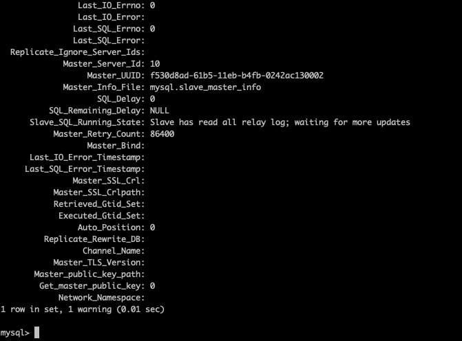
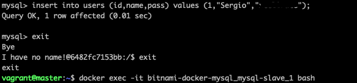

 # K8s cluster and Docker host for services

The following project deploys from Vagrant, a Kubernetes cluster with a master and two nodes. At the same time, master host is being used as a Docker server.

As part of the project requirements:

 - A Redis cluster with 6 replicas has been deployed in the K8s cluster. Redis is deployed in a persistent data mode.

 - A Rabbitmq cluster has been deployed with a master host and two slaves. All of them are docker containers and can be accessed by [http://172.22.0.10:15672](http://172.22.0.10:15672).


- MySQL replica is based on two docker containers, one deployed as a master and the other one deployed as a slave. MySQL is working on a persistent data mode.

## Getting Started

Before deploying the project, take into account the local environment specifications.

### Local environment
- MacOS Mojave 10.14.6
- Vagrant 2.2.7
- Virtualbox 6.1.16 r140961 (Qt5.6.3)
- Ansible 2.10.4
- Python 3.9.1

### Software stack deployed
- Kubernetes v1.20.2
- Redis 4.0.9
- RabbitMQ 3.7.17
- MySQL 8.0.3

### Environment variables

All the environment variables are declared in the k8sMaster.yml file.

#### Redis

No variables to be declared.

#### RabbitMQ

For RabbitMQ, can be declared the IP, user and password for accessing to the management interace:

  - RABBITMQ_DEFAULT_USER: rabbitmq_user
  - RABBITMQ_DEFAULT_PASS: rabbitmq_pass
  - RABBITMQ_MANAGEMENT_BIND_IP: 172.22.0.50

   :warning: **Please, bear in mind the variable must be identical to the IP declared in line 15, in the Vagrant file, otherwise it won't work.**

#### Mysql

For Mysql can be declared a custom DB, a custom user for custom DB, a custom replication user and the root password:

  - MYSQL_USER: mysql_user
  - MYSQL_REPLICATION_USER: repl_user
  - MYSQL_DATABASE: your_db
  - ROOT_PASS: root_pass

### Vagrant variables

In the Vagrant file the VMs settings can be declared:

- VM RAM = vbox.memory = 1024
- VM CPU = vbox.cpus = 1

### Installation

In order to have all the services deployed and running as detailed above, only a command it's needed:
```
vagrant up && vagrant provision master
```
"vagrant up" is needed for deploy the Kubernetes cluster before deploying the rest of the software.

"vagrant provision" is deploying the services. Redis is deployed within K8s cluster, however, RabbitMQ and MySQL are deployed as docker containers.

If the deployment fails for any reason (it shouldn't), run:
```
vagrant destroy

and

vagrant up && vagrant provision master
```

Please, be patient, the deployment spends about 20 minutes.

### Architecture deployed

After vagrant command execution, the platform the deployed looks like:


### Useful commands for checking

The following commands can help on the review of the test and for troubleshooting purposes.

#### Kubernetes

 - Check the cluster nodes status
    ```
    kubectl get nodes
    ```
 - Check the pods running on the K8s cluster
     ```
     kubectl get pods -A -o wide
     ```
 - Conect to a redis pod
      ```
      kubectl exec -it redis-cluster-0 bash

      or

      kubectl exec -it redis-cluster-0 redis-cli
      ```

  - Check services (Redis cluster):
    ```
    kubectl get pods -A -o wide
    ```
 #### Docker

- Check docker containers running for RabbitMQ and MySQL
    ```
    docker ps | grep -E 'mysql|rabbit'
    ```

- Connect to a docker
    ```
    docker exec -it docker_name bash
    ```

## The Demo!

Check in the following screenshots, how the deployment worked successfully:

### Redis:

Redis cluster is running as a Kubernetes service:


<br/><br/>

Kubernetes pods list where redis-cluster pods are shown:


<br/><br/>

In the following screenshot it's shown how to connect to a random Redis pod, a set and get operations are executed successfully on the pod 10.244.219.68:

Later the pod is identified as redis-cluster-1, and inmediately deleted. After deleting it, the data can be queried with no issues, so the data is persistent:


<br/><br/>

### RabbitMQ

Management interface is present and show the 3 nodes of the cluster:


<br/><br/>

As described in the variables section, the username and password, and also the IP of the management interface can be configured via Ansible variables:


<br/><br/>

### MySQL

The screenshot shows the docker containers running for MySQL (also for RabbitMQ), and the slave status waiting for master operations:



<br/><br/>

On the master host, a table is created, and also a new row is inserted:



<br/><br/>

Checking the slave status newly, the Read_Master_Log_Pos value has changed from 156 to 718, so the replication is working fine. (Please dismiss the error, it was because of my stupid speed):


<br/><br/>

The data is persistent because it's being saved on the docker server in the path /opt/mysql/data and it's mapped on the docker containers in the path /bitnami/mysql/data:


<br/><br/>

## Author

<table ><tr><td width=160 ></td><td> Hey!! it's me. <br/><br/>This is Sergio Sans, in the past I worked as a Linux and Infrastructure system engineer over 10 years. 3 years ago, I started to work on DevOps branch and I feel really good learning and improving my techie skills every day.<br></td></tr></table>


## Webgraphy

 - For creating this Readme: [https://en.wikipedia.org/wiki/Markdown](https://en.wikipedia.org/wiki/Markdown)
 - MySQL Task: [https://github.com/bitnami/bitnami-docker-mysql](https://github.com/bitnami/bitnami-docker-mysql)
 - RabbitMQ task: [https://medium.com/@kailashyogeshwar/rabbitmq-cluster-using-docker-compose-7397ea378d73](https://medium.com/@kailashyogeshwar/rabbitmq-cluster-using-docker-compose-7397ea378d73)
 - For Calico issue: [https://github.com/projectcalico/calico/issues/2561](https://github.com/projectcalico/calico/issues/2561)
 - For Redis task:
   - [https://medium.com/zero-to/setup-persistence-redis-cluster-in-kubertenes-7d5b7ffdbd98](https://medium.com/zero-to/setup-persistence-redis-cluster-in-kubertenes-7d5b7ffdbd98)
   - [https://github.com/Tiroshan/kubernetes-redis-cluster](https://github.com/Tiroshan/kubernetes-redis-cluster)
   - [https://rancher.com/blog/2019/deploying-redis-cluster](https://rancher.com/blog/2019/deploying-redis-cluster)
 - For Kubernetes cluster: [https://kubernetes.io/blog/2019/03/15/kubernetes-setup-using-ansible-and-vagrant/](https://kubernetes.io/blog/2019/03/15/kubernetes-setup-using-ansible-and-vagrant/)
